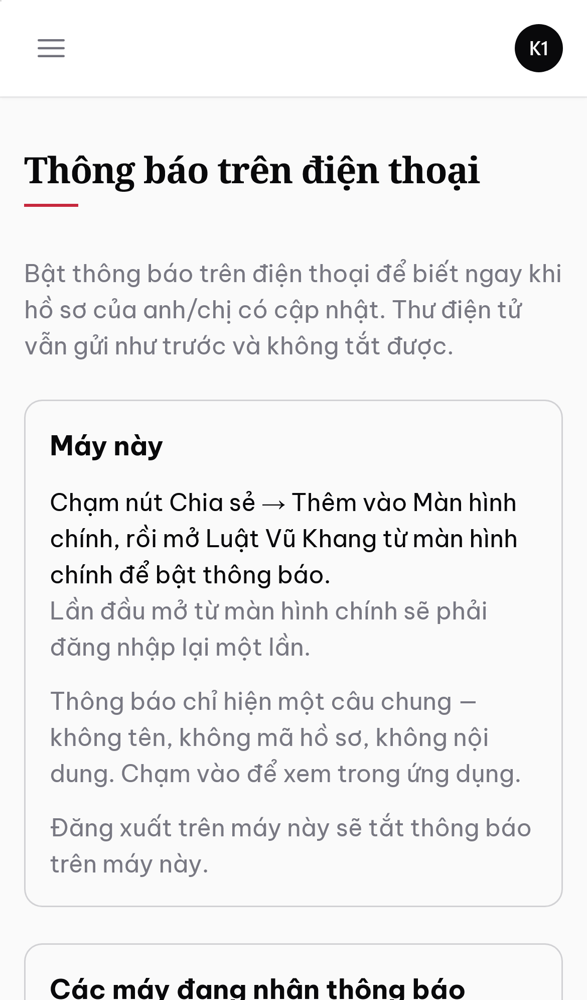
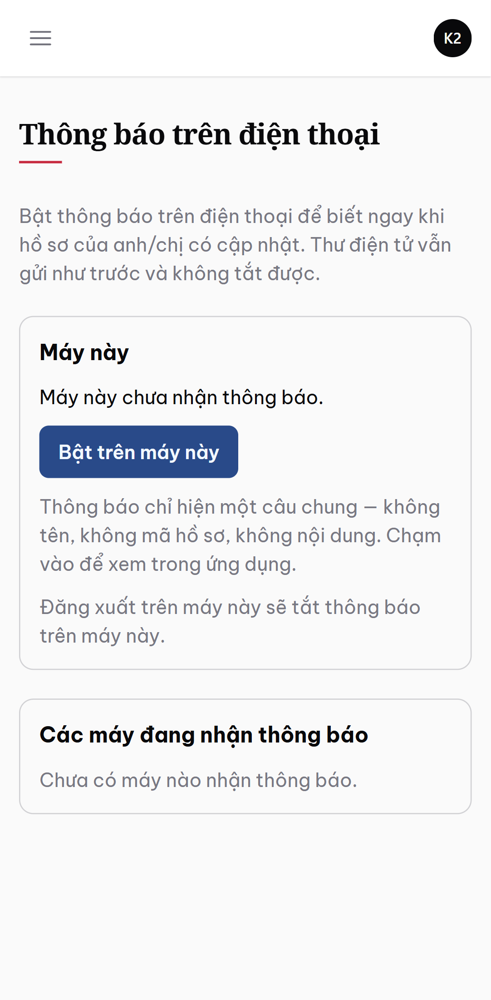
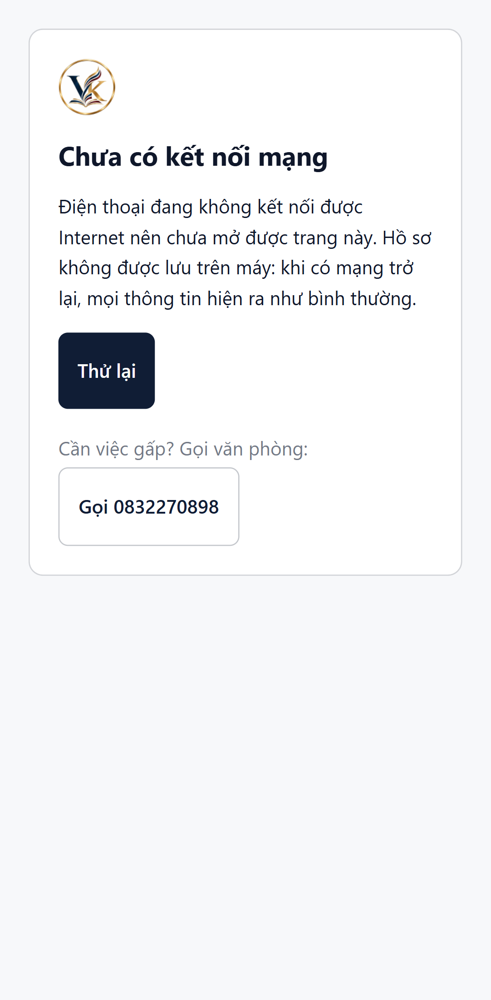

# VK-CRM — Quy trình chuẩn của văn phòng, và hệ thống đỡ ở chỗ nào

Tài liệu này là **một nguồn sự thật duy nhất về luồng nghiệp vụ**: từ lúc một người
lần đầu gọi tới văn phòng, cho tới lúc hồ sơ của họ được bàn giao và lưu trữ. Mỗi
bước ghi rõ ba thứ: **văn phòng làm gì**, **hệ thống đỡ bằng màn hình hay tác vụ
nào**, và **hiện đã có hay chưa**.

Rà soát đối chiếu mã nguồn ngày **2026-09-23**. Trạng thái ghi ở đây là thứ đo được
trong repo, không phải ý định.

**Cập nhật 2026-09-27 (M6.5 Task 21).** Đợt rà soát quy trình 2026-09-24
(`docs/audits/2026-09-24-quy-trinh.md`) chứng minh nhiều dòng **[Xong]** dưới đây chưa chạy thật
lúc ghi: không có màn hình gán đội ngũ, không có kiểm tra trùng khách, không có màn hình tra thư
đã gửi, 3/6 loại vụ việc không có danh mục để áp, và nhiều lỗi khác trên đường đi. Các dòng đó đã
được sửa trong M6.5; mỗi dòng ghi mã phát hiện và task đã sửa. Mọi task trừ Task 14 đã xong và qua
rà soát; **M6.5 chưa merge vào `main`** lúc viết (đang nghiệm thu). Chi tiết ở `docs/PROGRESS.md`,
"Ghi chú M6.5". Những gì vẫn chưa làm được sau M6.5 ghi rõ ở từng dòng, không để ẩn sau chữ
[Xong].

Ký hiệu: **[Xong]** đã chạy được và đã hợp nhất · **[Đang làm]** đã có mã, đang khép
lỗi · **[Có kế hoạch]** đã đặc tả chi tiết, chưa viết mã · **[Chưa có chủ]** chưa
thuộc kế hoạch nào.

---

## Giai đoạn 1 — Tiếp nhận và thẩm định đầu vào

Đây là giai đoạn quyết định nhiều tiền nhất và mang rủi ro nghề nghiệp cao nhất, và
cũng là giai đoạn hệ thống hiện **yếu nhất**.

| Văn phòng làm gì | Hệ thống đỡ bằng gì | Trạng thái |
|---|---|---|
| Ghi lại mỗi lần có người liên hệ, dù qua điện thoại, Zalo, website hay đến trực tiếp | Bảng tiếp nhận, màn hình nhập nhanh | **[Có kế hoạch]** M10 |
| **Kiểm tra xung đột lợi ích trước khi nghe nội dung vụ việc** | `RunConflictCheck` chạy ngay ở bước danh tính; kết quả Đỏ khoá phần nội dung | **[Có kế hoạch]** M10 — Action đã có từ M3 |
| Phát hiện cùng một người gọi nhiều lần | Dò trùng theo số điện thoại đã chuẩn hoá và tên đã chuẩn hoá | **[Có kế hoạch]** M10 |
| Bảo đảm không ai bị bỏ quên không gọi lại | Mốc phản hồi lần đầu, nhắc quá ngưỡng, widget trang chủ | **[Có kế hoạch]** M10 |
| Từ chối vụ việc và ghi lý do | Lý do xung đột chỉ hiện cho quản lý; người gọi không bao giờ được biết lý do thật | **[Có kế hoạch]** M10 |

**Luật nghề nghiệp đứng sau giai đoạn này.** Nếu nghe hết câu chuyện rồi mới phát
hiện bên kia là khách hàng hiện hữu thì thông tin bí mật đã nghe rồi và không rút lại
được. Vì vậy kiểm tra xung đột đứng **trước** phần nội dung, không phải sau. Và khi
từ chối vì xung đột, nói lý do thật cho người gọi chính là tiết lộ rằng có tồn tại
một khách hàng khác.

---

## Giai đoạn 2 — Mở hồ sơ

| Văn phòng làm gì | Hệ thống đỡ bằng gì | Trạng thái |
|---|---|---|
| Tạo khách hàng, kiểm tra trùng | Resource `Client`, số định danh mã hoá khi lưu; trùng số điện thoại/CCCD thì cảnh báo kèm liên kết hồ sơ trùng, phải xác nhận mới tạo được bản thứ hai | **[Xong]** sau M6.5 — trước đó không có kiểm tra trùng nào (`intake/intake-07`); sửa ở Task 6. Form khách vượt độ dài cột thành lỗi 500 trên MariaDB (`intake-08`), sửa ở Task 6. Dò trùng theo tên và theo người gọi lại vẫn là việc của M10 |
| Mở vụ việc, sinh mã không bao giờ đổi | `OpenMatter`, mã dạng `VK-2026-DD-0147`; luật sư tra khách đúng số điện thoại/CCCD hoặc tạo khách mới ngay trong form; sửa được vụ sau khi mở, huỷ được vụ mở nhầm | **[Xong]** sau M6.5 — trước đó luật sư không mở được vụ cho khách mới (`intake-03`, `roles/roles-04`; Task 6, R4) và vụ không sửa được sau khi mở (`intake-06`, `spec-gap/spec-gap-06`; Task 5) |
| Chạy kiểm tra xung đột trước khi nhận | `RunConflictCheck` hiện ngay trong biểu mẫu tạo; kết quả Đỏ phải có lý do ghi đè | **[Xong]** sau M6.5 — rà soát tìm: khách quay lại luôn ra vàng với chính hồ sơ cũ, hai khách của văn phòng đối nhau vẫn ra xanh, ghi đè một lần rồi chặn mãi, sửa định danh khách không ai được báo, hai người mở hai vụ đối nhau cùng lúc cùng ra xanh (`conflict/conflict-01`–`04`, `06`, `07`, `11`, `12`); sửa ở Task 8 (R13) |
| Khai các bên trong vụ việc | Tab **Các bên**; thêm, sửa, gỡ một bên (gỡ là xoá mềm kèm lý do); mỗi lần đều chạy lại kiểm tra xung đột | **[Xong]** sau M6.5 — trước đó không sửa hay gỡ được bên đã nhập, số điện thoại viết kiểu `(+84) 912 345 678` bị từ chối (`conflict-05`, `09`, `10`); sửa ở Task 9 (R14) |
| Giao luật sư phụ trách và đội ngũ | Tab **Đội ngũ**: thêm, gỡ luật sư phối hợp, trợ lý, người theo dõi; đổi luật sư phụ trách qua **Bàn giao**; phạm vi nhìn thấy suy từ đội ngũ | **[Xong]** sau M6.5 — trước đó **không có màn hình nào** thêm người vào đội ngũ: mọi vụ chỉ có luật sư phụ trách, trợ lý không bao giờ thấy vụ (`intake/intake-01`, `roles/roles-03`, `spec-gap/spec-gap-01`, `e2e/F4`, critical); sửa ở Task 3 (R6), bàn giao một vụ ở Task 4 (R7) |
| Áp danh mục giấy tờ theo loại vụ việc | `ApplyChecklistTemplate`, màn hình quản lý danh mục mẫu trên loại vụ việc, nút thêm đầu mục cho một vụ, thanh tiến độ `X/Y` | **[Xong]** sau M6.5 — trước đó không có màn hình danh mục mẫu nào và 3/6 loại vụ việc mở ra với danh mục rỗng, khách không nộp được giấy tờ (`intake/intake-02`, `checklist/checklist-02`, `roles/roles-06`, `spec-gap/spec-gap-04`, critical; Task 15); thanh `X/Y` đếm nhầm văn bản văn phòng phát hành (`checklist-05`; Task 17, SPEC §4.10) |
| Ký hợp đồng dịch vụ, chốt giá trị và các đợt thu | Hợp đồng một giá trị, chia đợt gắn vào giai đoạn | **[Có kế hoạch]** M9 |

---

## Giai đoạn 3 — Xử lý vụ việc

| Văn phòng làm gì | Hệ thống đỡ bằng gì | Trạng thái |
|---|---|---|
| Chuyển giai đoạn, viết cập nhật cho khách | Biểu mẫu chuyển giai đoạn có phần xem trước đúng thứ khách sẽ đọc; vào giai đoạn kết thúc thì vụ được đóng (`closed_at`) | **[Xong]** sau M6.5 — trước đó tab Tiến độ vỡ vĩnh viễn sau lần cập nhật đầu trên vụ chưa bật cổng (`e2e/F1`, critical; Task 1), máy chủ thư chết thì luật sư gặp lỗi 500 (`stage/stage-01`; Task 11), không chỗ nào ghi `closed_at` (`stage-03`; Task 5), bấm hai lần sinh hai dòng (`stage-05`; Task 10) |
| Ghi chú nội bộ không bao giờ lộ ra ngoài | Ghi chú nội bộ tách khỏi nội dung công bố, chặn ở ba lớp | **[Xong]** |
| Nhận giấy tờ khách nộp, duyệt hoặc từ chối kèm lý do | Tab **Danh mục hồ sơ**, duyệt ngay trên dòng; một lần nộp nhiều trang là một phiên bản; duyệt gắn với đúng những tệp người duyệt đã thấy | **[Xong]** sau M6.5 — trước đó giấy nhiều trang nộp từng tệp làm trang trước biến mất, và tệp đến lúc hộp xác nhận đang mở vẫn được nhận (`checklist-03`, `04`; Task 17, R10, R11). **Còn thiếu:** khách chưa được báo bằng thư khi giấy tờ bị từ chối (`checklist-01`, chuyển M6 Task 3) — khách chỉ thấy lý do khi tự mở cổng |
| Lưu tài liệu theo bốn nhóm, nhóm nội bộ không bao giờ hiện cho khách | Tab **Tài liệu**, nhóm D nền khác màu và không có nút công bố; văn bản nhóm B đi trình duyệt → đã ký, đã nộp → công bố | **[Xong]** sau M6.5 — trước đó văn bản nhóm B **không bao giờ công bố được** vì không có đường tới `signed_filed` (`docs/docs-1`, critical), và đổi nhóm B → C vượt được vòng đời (`docs-2`); sửa ở Task 16 (R9). Rút lại một tài liệu đã công bố: chưa có, M7 Task 7 |
| **Đặt mốc thời hạn tố tụng** | Tab **Mốc thời hạn**: thêm nhanh, đổi người phụ trách, quá hạn và hết hạn hôm nay tô đỏ, còn dưới bảy ngày tô vàng, đã xong thì xám | **[Xong]** 2026-09-23 — **sửa và xoá một mốc** (phiên toà hoãn) chưa có lúc rà soát (`deadlines/F7`), đang hoàn tất ở M6.5 Task 14; widget "Mốc thời hạn 7 ngày tới" trên trang chủ (`F5`, `spec-gap-05`) cũng ở Task 14 |
| Được nhắc trước khi tới hạn, theo bậc | Tác vụ `CheckDeadlines` 07:00 hằng ngày, bậc 14/7/3/1 ngày và quá hạn; thư qua hàng đợi, người nhận là người được xem vụ | **[Xong]** (M6 Task 6, trên `main` từ 2026-09-23) và sửa ở M6.5 — một hộp thư lỗi dừng cả lượt nhắc và mất nhật ký (`deadlines/F1`, `notify-2`, critical; Task 11), thư vụ hạn chế gửi tới người không được xem (`F2`; Task 12), người phụ trách bị khoá thì mốc im lặng (`F4`; Task 4, 12). Thông báo cảnh báo quá hạn trong hệ thống (`F6`) đang hoàn tất ở Task 14 |
| **Ghi lại cuộc gọi, buổi làm việc với khách** | Tab **Liên lạc**, ghi một cuộc gọi trong dưới 15 giây | **[Có kế hoạch]** M7, mới bổ sung 2026-09-22 |
| Biết hồ sơ nào đang đứng im quá lâu | Cảnh báo 14 ngày trong hệ thống, 21 ngày gửi thư cho quản lý | **[Có kế hoạch]** M6 |
| Bàn giao khi luật sư nghỉ việc mà không rơi mốc hạn nào | `ReassignMatter` cho một vụ: đổi luật sư phụ trách, chuyển mốc chưa xong và yêu cầu khách chưa đóng; không cho vô hiệu hoá hay xoá người còn giữ việc | **[Xong]** cho từng vụ (M6.5 Task 4, R7, kéo lên từ M7). **[Có kế hoạch]** M7: màn hình bàn giao hàng loạt, và thư tổng hợp mốc hạn cho người nhận |

---

## Giai đoạn 4 — Khách hàng theo dõi

| Khách làm gì | Hệ thống đỡ bằng gì | Trạng thái |
|---|---|---|
| Đăng nhập an toàn trên điện thoại | Mật khẩu cộng mã một lần qua email, khoá sau năm lần sai theo cả tài khoản lẫn địa chỉ mạng; văn phòng mở khoá được | **[Xong]** sau M6.5 — trước đó ô "Ghi nhớ đăng nhập" cho vào lại 400 ngày không cần mật khẩu lẫn mã (`portal/portal-1`), khách bị xoá vẫn đăng nhập được (`portal-3`), và văn phòng không có cách mở khoá (`portal-4`); sửa ở Task 2 và 7 (R12) |
| Xem danh sách hồ sơ của mình | Màn hình danh sách, một hồ sơ thì vào thẳng trang tiến độ | **[Xong]** |
| Xem hồ sơ đang ở giai đoạn nào, sắp tới làm gì | Trang tiến độ bảy khối, viết cho người không học luật, có tóm tắt cho khách | **[Xong]** sau M6.5 — "Tóm tắt cho khách" trước đó không hiện ở đâu (`portal-2`; Task 5) |
| Biết còn thiếu giấy tờ gì và nộp bằng ảnh chụp | Màn hình nộp giấy tờ, chụp thẳng từ điện thoại, một lần nộp nhiều trang | **[Xong]** sau M6.5 — trước đó 3/6 loại vụ việc không có đầu mục nào để nộp (`checklist-02`; Task 15) và giấy nhiều trang bị ghi đè từng trang (`checklist-03`; Task 17) |
| Đọc lý do khi giấy tờ bị từ chối và nộp lại | Lý do hiện nguyên văn, bản nộp lại nối vào bản cũ | **[Xong]** — khách phải tự mở cổng mới thấy; thư báo bị từ chối là M6 Task 3 |
| Hỏi lại văn phòng và nhận trả lời | Yêu cầu từ khách, trả lời theo luồng; hộp thư văn phòng sắp theo hoạt động gần nhất | **[Xong]** phần hỏi và trả lời trên màn hình. **Còn thiếu:** văn phòng **không được báo** khi khách gửi yêu cầu mới hay hỏi tiếp, nhân sự phải tự mở tab Yêu cầu của từng vụ (`requests/REQ-1`, `REQ-2`); khách không được báo khi văn phòng trả lời (`REQ-4`). Cả ba chuyển sang M6 Task 4 |
| Nhận thư báo khi có cập nhật mới | Bốn mẫu thư cho khách, chỉ chứa nội dung đã công bố | **[Có kế hoạch]** M6 |
| Nhận thông báo trên điện thoại, chạm một lần là mở đúng hồ sơ | Ứng dụng cài từ trình duyệt (không qua chợ ứng dụng), thông báo đẩy đi cùng bốn thư của khách, màn hình khoá chỉ hiện một câu chung | **[Đang làm]** M12 — đã có mã, chờ gộp và chờ chủ văn phòng thử trên iPhone, Android thật; hướng dẫn cài ở mục cuối tài liệu này |
| **Xem đã đóng bao nhiêu trên tổng giá trị hợp đồng** | Hợp đồng và lịch thu trên cổng khách | **[Có kế hoạch]** M9 — *còn một quyết định của chủ văn phòng, xem dưới* |

Văn phòng nhìn ngược lại: mỗi dòng đã công bố mang nhãn **khách đã xem lúc nào**, và
dòng chưa ai xem quá năm ngày thì nhắc luật sư gọi điện.

---

## Giai đoạn 5 — Tiền

| Văn phòng làm gì | Hệ thống đỡ bằng gì | Trạng thái |
|---|---|---|
| Chốt một giá trị hợp đồng duy nhất | Hợp đồng gắn vào vụ việc, sửa bằng phụ lục chỉ thêm không sửa | **[Có kế hoạch]** M9 |
| Chia thành các đợt thu gắn vào tiến độ | "Thu đợt hai khi nộp đơn khởi kiện" | **[Có kế hoạch]** M9 |
| Ghi từng khoản tiền thật sự nhận, ai ghi, nhận bằng cách nào | Bảng thanh toán có người ghi và phương thức | **[Có kế hoạch]** M9 |
| Nhìn bức tranh tiền: đã thu trên tổng, còn phải thu | Trang biểu đồ lọc theo thời gian, luật sư, lĩnh vực | **[Có kế hoạch]** M9 |
| Không đóng hồ sơ nhầm khi còn công nợ | Đóng vụ việc không bị chặn, nhưng xoá thì bị chặn khi còn dư nợ | **[Có kế hoạch]** M9 |

---

## Giai đoạn 6 — Kết thúc, bàn giao, lưu trữ

| Văn phòng làm gì | Hệ thống đỡ bằng gì | Trạng thái |
|---|---|---|
| Sinh gói bàn giao cho khách | Tệp nén nhóm A/B/C kèm mục lục PDF và toàn bộ tường trình tiến độ, không bao giờ lẫn tài liệu nội bộ | **[Có kế hoạch]** M7 |
| Cho khách tải về từ cổng, có hạn | Quyền tra cứu hết sau 90 ngày mặc định, dữ liệu vẫn nguyên bên trong | **[Có kế hoạch]** M7 |
| Giữ hồ sơ theo chính sách lưu trữ | Hạn lưu trữ mặc định 10 năm, hệ thống **cảnh báo chứ không bao giờ tự xoá** | **[Có kế hoạch]** M7 |
| Tìm lại một hồ sơ cũ bằng bất cứ thứ gì nhớ được | Ô tìm kiếm sáu nguồn, kết quả luôn đi qua phân quyền | **[Có kế hoạch]** M7 |

---

## Nền móng chạy dưới tất cả

| Thứ gì | Trạng thái |
|---|---|
| Phân quyền theo vai trò, phạm vi nhìn thấy suy từ đội ngũ vụ việc | **[Xong]** sau M6.5 — trước đó luật sư xem và sửa được tài khoản cổng của mọi khách, kể cả ép chuyển sang khách khác (`roles/roles-01`, critical; `roles-02`; Task 2), và quyền "hạn chế" của trợ lý thực tế là toàn quyền (`roles-05`; Task 5, 10, R5) |
| Ba lớp bảo vệ độc lập cho dữ liệu khách hàng trên cổng | **[Xong]** — khách đã bị xoá mềm nay cũng bị chặn ở cả ba lớp (`portal-3`; M6.5 Task 2) |
| Không có quyền và không tồn tại đều trả lời giống hệt nhau | **[Xong]** |
| Nhật ký hoạt động cho mọi thao tác nhạy cảm | **[Xong]** một phần — trước M6.5 Task 20 trang nhật ký hiện khoá dịch thô và không hiện chi tiết (kể cả lý do ghi đè xung đột); nay đọc được, che số điện thoại/email/địa chỉ và chặn số CCCD. Còn thiếu tab nhật ký riêng của từng vụ việc, **[Có kế hoạch]** M7 |
| Tệp nằm ngoài thư mục web, chỉ tải qua đường ký có hạn năm phút | **[Xong]** |
| Thương hiệu văn phòng trên mọi màn hình | **[Xong]** |
| Thư đi ra đều có nhật ký để tra khi khách nói không nhận được | **[Xong]** sau M6.5 — bảng `outbound_messages` có từ M6 Task 1 (2026-09-23) nhưng **không có màn hình nào để tra** (`notify/notify-8`, `spec-gap/spec-gap-07`); M6.5 Task 13 thêm trang nhật ký thư, và nút "Thư đã gửi" trên trang vụ việc mở trang đó đã lọc theo vụ (mỗi người chỉ thấy thư của vụ mình được xem; admin thấy mọi dòng). Nút gửi lại một thư thất bại: M6 Task 10 |
| Giám sát cron: cron chết thì trang chủ nói ra | **[Xong]** 2026-09-23 |
| Xác thực hai lớp cho toàn bộ tài khoản nội bộ | **[Có kế hoạch]** M8 |
| Sao lưu hằng ngày **đã thử khôi phục thật** | **[Có kế hoạch]** M8 |

---

## Chưa có chủ — cần chủ văn phòng quyết

Năm thứ dưới đây không nằm trong bất kỳ kế hoạch nào. Tôi không tự thêm, vì mỗi thứ
đều đổi phạm vi công việc.

1. **Kho mẫu văn bản để soạn thảo.** Hệ thống hiện quản lý *danh mục giấy tờ cần có*,
   không quản lý *mẫu để soạn*. Với văn phòng soạn nhiều đơn từ lặp lại thì đây là
   thứ tiết kiệm thời gian nhiều nhất sau nhắc hạn. Đề xuất: một milestone riêng sau
   khi hệ thống chạy thật vài tháng, vì mẫu phải lấy từ chính văn bản văn phòng đang dùng.
2. **Lịch phiên toà dạng lịch.** Dữ liệu mốc hạn đã có, nhưng nhìn theo danh sách chứ
   chưa nhìn theo tháng. Rẻ để thêm sau khi màn hình mốc hạn của M6 xong.
3. **Giao việc nội bộ.** Hiện chỉ có mốc hạn gắn người phụ trách. Một văn phòng đông
   người thường cần giao việc nhỏ không phải mốc tố tụng.
4. **Hoá đơn điện tử.** M9 ghi thuế giá trị gia tăng trên hợp đồng, nhưng phát hành
   hoá đơn điện tử là một tích hợp với nhà cung cấp, cần chọn nhà cung cấp trước.
5. **Tính phí theo giờ.** Cố ý hoãn: mô hình hiện tại là ký một lần thu theo giai
   đoạn. Quan hệ dữ liệu đã chừa sẵn chỗ nên gắn thêm sau không phải sửa mô hình.

Và hai câu hỏi đang chờ trả lời, đã hỏi trước đó:

- **Bốn thông tin pháp lý của văn phòng**: mã số thuế, Đoàn Luật sư, số Giấy đăng ký
  hoạt động, địa chỉ trụ sở. Chúng xuất hiện ở chân thư, mục lục gói bàn giao và tài
  liệu triển khai.
- **Khách có được xem hợp đồng và lịch thu của mình trên cổng không.** Lập luận thuận:
  họ đã ký, đó là thông tin của chính họ. Lập luận nghịch: một khách đang tranh chấp
  đọc dòng "đợt ba thu khi có bản án sơ thẩm" có thể hiểu thành một lời hứa về kết quả.
  Mặc định hiện tại là **không**, và mọi thứ được đóng kín sẵn để câu trả lời "có" về
  sau chỉ là một lần nới có kiểm soát.

---

## Ba chỗ trống tìm ra trong lượt rà soát ngày 2026-09-22

Ghi lại riêng, vì cả ba đều là **tính năng đã được đặc tả, có bảng dữ liệu, có phân
quyền, nhưng không có màn hình** — loại thiếu sót khó thấy nhất, bởi mọi test đều xanh.

1. **Không có màn hình tạo mốc thời hạn.** Nghiêm trọng nhất trong ba: tác vụ nhắc hạn
   của M6 sẽ chạy hằng ngày trên một bảng rỗng và vẫn xanh. Một tính năng đúng, chạy
   đều, và vô nghĩa. Đã đưa thành Task 5 của M6, đứng **trước** tác vụ nhắc. Xong 2026-09-23;
   sửa và xoá mốc thêm ở M6.5 Task 14.
2. **Không có màn hình ghi nhật ký liên lạc**, dù đặc tả liệt kê nó ngay trên dòng
   milestone bàn giao. Đã đưa thành Task 8 của M7, kèm một lỗ hổng phân quyền mang từ
   rà soát trước sang phải vá cùng lúc.
3. **Không có tab nhật ký riêng của từng vụ việc.** Nhật ký toàn hệ thống đã có; đây
   là bản lọc theo một vụ việc. Gộp vào cùng Task 8 của M7.

---

## Tôi sẽ dựa vào gì để nói "xong và sẵn sàng đưa vào hoạt động"

Viết ra trước, để lời báo cáo về sau kiểm được chứ không phải tin. Tôi chỉ báo xong
khi **cả ba nhóm dưới đây đều đạt**, và báo cáo sẽ kèm bản ghi từng bước chứ không
kèm một câu khẳng định.

### A. Ba vai chạy thông trên dữ liệu thật

Chạy tay, trên một cơ sở dữ liệu vừa dựng lại từ đầu, không phải trên test.

1. **Quản trị** tạo khách hàng mới, mở vụ việc, hệ thống chặn đúng khi bên đối lập
   trùng một khách hàng hiện hữu, và mọi lần kiểm tra đều để lại dấu vết.
2. **Luật sư** áp danh mục giấy tờ, đặt một mốc thời hạn, chuyển giai đoạn kèm một
   dòng cập nhật công bố cho khách, công bố một tài liệu, và ghi lại một cuộc gọi.
3. **Khách hàng** đăng nhập trên khổ điện thoại thật, thấy đúng dòng vừa công bố,
   thấy còn thiếu giấy tờ gì, nộp một ảnh chụp, bị từ chối và đọc được lý do nguyên
   văn, nộp lại, rồi gửi một câu hỏi và nhận trả lời.
4. **Quay lại phía văn phòng**: nhãn khách đã xem hiện đúng thời điểm, giấy tờ khách
   nộp duyệt được, và thanh tiến độ nhảy đúng.
5. **Ranh giới**: không một đường nào — kể cả sửa tham số trên thanh địa chỉ — cho
   một khách thấy dữ liệu của khách khác hoặc thấy tài liệu nội bộ.

### B. Chất lượng đo được, không phải cảm nhận

- Toàn bộ bộ kiểm thử xanh trên **cả hai** cơ sở dữ liệu: bản nhẹ dùng khi phát
  triển và bản thật dùng khi chạy.
- Độ phủ của tầng nghiệp vụ và tầng phân quyền từ 80% trở lên, có số đo dán kèm.
- Mỗi milestone đã qua **một lượt rà soát độc lập được giao nhiệm vụ giả định có
  một lỗi nghiêm trọng**, và mọi phát hiện đã đóng hoặc đã ghi rõ lý do chưa đóng.
- Dựng lại toàn bộ cơ sở dữ liệu từ số không và quay ngược lại được trọn vòng.

### C. Sẵn sàng vận hành thật

- Tên miền, chứng chỉ bảo mật, và **địa chỉ máy chủ trung gian điền đúng** — chừng
  nào ô này còn trống thì một người gõ sai mật khẩu năm lần sẽ khoá cả cổng khách.
- Đúng một dòng lịch chạy tự động, và trang chủ tự báo đỏ khi lịch đó chết.
- Sao lưu hằng ngày **đã thử khôi phục thật một lần**, có ghi thời gian khôi phục.
- Xác thực hai lớp bật cho toàn bộ tài khoản nội bộ.
- Bốn thông tin pháp lý của văn phòng đã điền: mã số thuế, Đoàn Luật sư, số Giấy
  đăng ký hoạt động, địa chỉ trụ sở.
- Tài liệu cài đặt đã được **một người chưa từng đọc mã nguồn** dựng lại thành công
  trên một máy chủ trống.

### Về việc đưa lên điện thoại thành ứng dụng

Cổng khách hàng đã được dựng cho điện thoại ngay từ đầu: một cột, chữ to, vùng bấm
44 điểm ảnh, không bảng ngang, chụp ảnh thẳng từ máy ảnh. Mở bằng trình duyệt điện
thoại là dùng được ngay, không cần chờ gì.

**Cập nhật 2026-10-04 (M12).** Từ M12, cổng khách hàng và trang nội bộ cài được thành
ứng dụng trên điện thoại ngay từ trình duyệt, không qua chợ ứng dụng: biểu tượng trên
màn hình chính, cửa sổ riêng, và **thông báo đẩy** khi hồ sơ có việc mới (Android và
iPhone iOS 16.4 trở lên). Ứng dụng chính là website, nên không có bản sao hồ sơ nào nằm
trên điện thoại và không có gì để "đồng bộ"; mất mạng thì hiện một trang tiếng Việt kèm
số hotline. Thông báo chỉ là một câu chung, không tên, không mã hồ sơ — màn hình khoá
không phải màn hình của văn phòng — và thư điện tử vẫn gửi như trước. Hướng dẫn cài cho
khách: mục "Hướng dẫn cài ứng dụng Luật Vũ Khang trên điện thoại" ở cuối tài liệu này.
M12 đã có mã (nhánh `m12-pwa-push`), đang chờ gộp và chờ chủ văn phòng thử trên iPhone,
Android thật (`docs/research/2026-10-01-pwa-kiem-tra-may-that.md`).

Ứng dụng tải từ chợ ứng dụng (App Store, Google Play) vẫn để sau, và chỉ đáng làm khi
thấy một dấu hiệu đo được sau vài tháng vận hành — ví dụ nhiều khách dùng iPhone không
tự cài được, hay cần một khả năng mà ứng dụng web trên iPhone không có. Kiến trúc đã
chừa sẵn chỗ: **toàn bộ nghiệp vụ nằm trong tầng Action chứ không nằm trong màn hình**,
nên ứng dụng gốc chỉ cần một lớp giao tiếp dữ liệu gọi lại đúng những Action đang chạy,
không phải viết lại luật nào. Dấu hiệu nào, và làm thế nào: mục cuối của kế hoạch M12
(`docs/superpowers/plans/2026-09-24-m12-pwa.md`).

---

## Hướng dẫn cài ứng dụng Luật Vũ Khang trên điện thoại

*Dành cho khách hàng. Văn phòng gửi phần này kèm thư kích hoạt tài khoản cổng khách hàng. Kho
mã nguồn là riêng tư nên khách không mở được đường dẫn tới tệp này: chép phần chữ và ảnh dưới
đây vào thư hay tin nhắn, hoặc in ra. Ảnh ghi "mô phỏng" chụp trên máy tính với khổ màn hình
điện thoại; ô ghi "ảnh do chủ văn phòng chụp khi chạy danh sách kiểm tra" là chỗ để ảnh thật
từ iPhone và Android (mục A, C, D của `docs/research/2026-10-01-pwa-kiem-tra-may-that.md`) — chưa
có ảnh thật thì gửi bản không ảnh.*

Ứng dụng **Luật Vũ Khang** chính là trang theo dõi hồ sơ của văn phòng, đặt thành một biểu
tượng trên màn hình chính điện thoại. Không phải tải từ App Store hay Google Play. Hồ sơ của
anh/chị không được lưu trên điện thoại: mỗi lần mở, ứng dụng lấy thông tin mới nhất từ văn
phòng; mất mạng thì hiện trang "Chưa có kết nối mạng" kèm số điện thoại của văn phòng.

### Trước khi bắt đầu

- Đã kích hoạt tài khoản theo thư của văn phòng (đặt mật khẩu của riêng anh/chị).
- Mở được hộp thư email trên chính điện thoại này: mỗi lần đăng nhập, văn phòng gửi một mã 6 số
  qua email.
- iPhone cần **iOS 16.4 trở lên** để nhận thông báo (xem ở **Cài đặt → Cài đặt chung → Giới
  thiệu → Phiên bản iOS**).

### Trên iPhone

1. Mở **Safari** — không dùng Chrome, không mở từ trong Zalo hay Facebook — và vào địa chỉ cổng
   khách hàng văn phòng gửi (ví dụ `https://khachhang.luatvukhang.com/portal`).
2. Chạm nút **Chia sẻ** (ô vuông có mũi tên chỉ lên, ở thanh dưới) → kéo xuống → **Thêm vào Màn
   hình chính** → **Thêm**. Tên gợi ý là "Luật Vũ Khang".

   > [Chỗ ảnh: nút Chia sẻ và dòng "Thêm vào Màn hình chính" trên iPhone.]
   > [ảnh do chủ văn phòng chụp khi chạy danh sách kiểm tra — mục A, bước A2]

3. Về màn hình chính, chạm biểu tượng **Luật Vũ Khang**. Ứng dụng mở trong cửa sổ riêng, không có
   thanh địa chỉ của Safari. Lần đầu mở từ màn hình chính sẽ phải đăng nhập lại một lần. Đó là
   bình thường: iPhone giữ ứng dụng tách khỏi Safari. Đăng nhập bằng email, mật khẩu, rồi mã 6 số
   trong email.
4. Bật thông báo: chạm ảnh đại diện ở góc trên bên phải → **Thông báo trên điện thoại** → **Bật
   trên máy này** → khi điện thoại hỏi, chọn **Cho phép**.

Nếu mở trang **Thông báo trên điện thoại** bằng Safari thường (chưa cài), thay cho nút bật là câu:
"Chạm nút Chia sẻ → Thêm vào Màn hình chính, rồi mở Luật Vũ Khang từ màn hình chính để bật thông
báo." kèm lời nhắc "Lần đầu mở từ màn hình chính sẽ phải đăng nhập lại một lần." — làm bước 2 và 3
rồi bật từ trong ứng dụng. iPhone chỉ cho nhận thông báo trong ứng dụng đã thêm vào màn hình chính.

### Trên điện thoại Android

1. Mở **Chrome** và vào địa chỉ cổng khách hàng văn phòng gửi.
2. Chạm **⋮** (ba chấm, góc trên bên phải) → **Cài đặt ứng dụng** (có máy ghi **Thêm vào màn hình
   chính** → **Cài đặt**). Hộp thoại ghi "Luật Vũ Khang — Khách hàng"; dưới biểu tượng trên màn
   hình chính là "Luật Vũ Khang" (nền xanh đậm).

   > [Chỗ ảnh: hộp thoại cài đặt của Chrome.]
   > [ảnh do chủ văn phòng chụp khi chạy danh sách kiểm tra — mục C, bước C2]

3. Mở ứng dụng từ màn hình chính, đăng nhập bằng email, mật khẩu, rồi mã 6 số trong email.
4. Bật thông báo: chạm ảnh đại diện ở góc trên bên phải → **Thông báo trên điện thoại** → **Bật
   trên máy này** → **Cho phép**.

### Điều nên biết

- Thông báo chỉ hiện một câu chung, ví dụ "Hồ sơ của anh/chị có cập nhật mới. Chạm để xem." —
  không tên, không mã hồ sơ, không nội dung, vì người khác có thể nhìn thấy màn hình khoá. Chạm
  vào để xem trong ứng dụng.
- Thư điện tử vẫn gửi như trước và không tắt được: thông báo trên điện thoại chỉ là thêm một cách
  báo nhanh.
- Đăng xuất trên máy này sẽ tắt thông báo trên máy này. Điện thoại dùng chung với người nhà thì
  nên đăng xuất sau khi xem.
- Không dùng ứng dụng khoảng hai tiếng thì lần sau phải đăng nhập lại (mật khẩu và mã 6 số) — để
  giữ an toàn cho hồ sơ. Chạm một thông báo lúc đó thì đăng nhập xong sẽ về đúng trang của thông
  báo.
- Đổi điện thoại hay mất điện thoại: đăng nhập trên máy khác → **Thông báo trên điện thoại** →
  chạm **Gỡ** ở máy cũ (hoặc **Gỡ mọi thiết bị**), hoặc gọi văn phòng.
- Mất mạng thì ứng dụng hiện trang "Chưa có kết nối mạng" có số điện thoại của văn phòng (chạm để
  gọi) và nút **Thử lại**.

### Nhân sự của văn phòng

Cùng các bước trên, với địa chỉ `/admin` thay cho `/portal`: ứng dụng nội bộ tên **VK Nội bộ**
(biểu tượng nền sáng, phân biệt với ứng dụng của khách), đăng nhập bằng mật khẩu và mã của ứng dụng
xác thực. Ứng dụng nội bộ báo khi có mốc thời hạn cần chú ý, khi khách gửi giấy tờ hay câu hỏi, và
khi có khoản thu quá hạn (người theo dõi công nợ). Nếu văn phòng bật giới hạn địa chỉ cho trang nội
bộ (`ADMIN_IP_ALLOWLIST`), ứng dụng nội bộ chỉ mở được trong mạng văn phòng — câu hỏi 2 cho chủ văn
phòng trong `docs/PROGRESS.md`, "Ghi chú M12".
